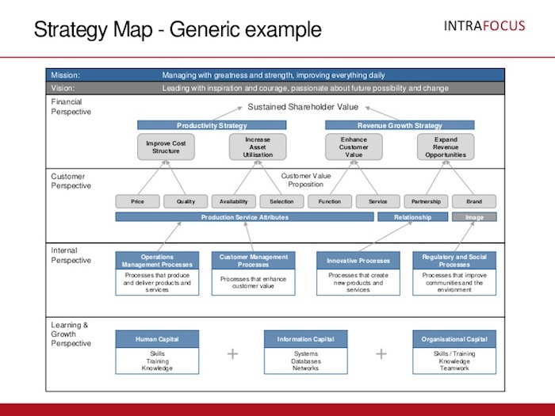

```{r setup, include=FALSE}
knitr::opts_chunk$set(echo = FALSE)
```

## Werkcollege 1 - Waarde

<a href="https://image.slidesharecdn.com/intrafocus-strategymaptemplates-120913042508-phpapp01/95/strategy-map-templates-5-728.jpg?cb=1347510838" target="_blank"></a>

## Werkcollege 2 - Free Cash Flows

- Operating Cash Flows
- Verandering Nettowerkkapitaal
- Investering
- [Oefening](https://drive.google.com/open?id=0B63Xv-VjVpxSZmpxbXh4NnVvd0k)

## Werkcollege 3 - Risico

- Statistiek
- Diversificatie
- Simulatie

## Werkcollege 4 - Rendement

- Eigen Vermogen
- Vreem Vermogen
- WACC

